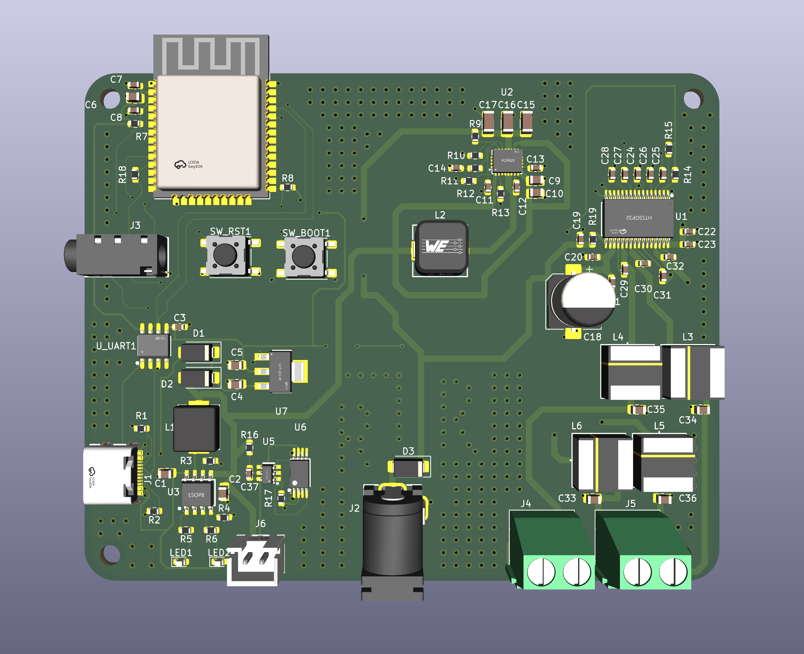
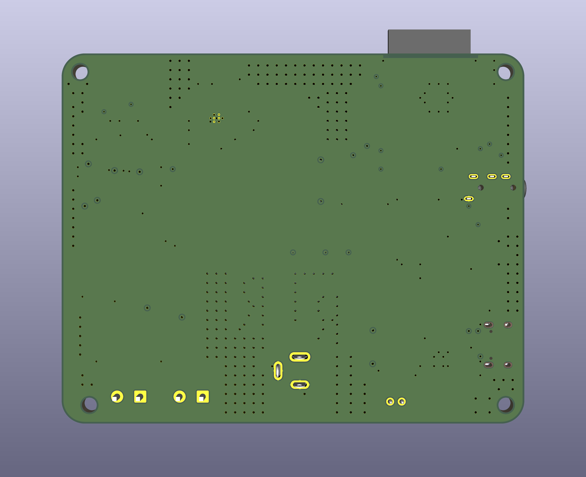
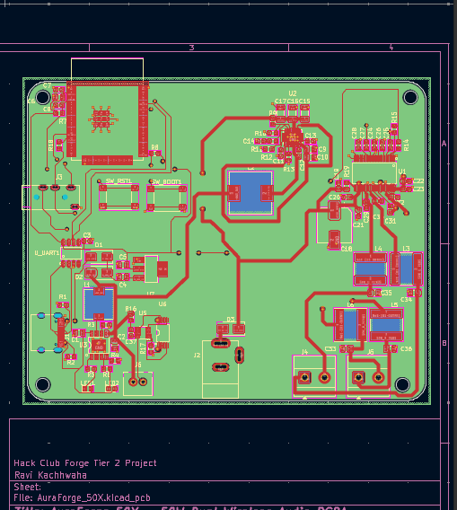
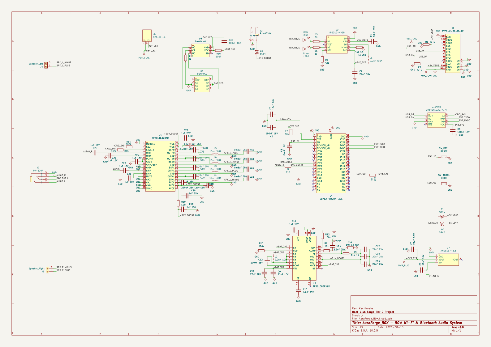
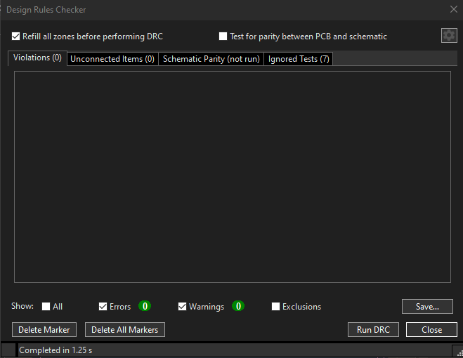

# AuraForge 50X — Programmable 50W High-Fidelity Wireless DSP & CSI Sensing Platform

[](https://kicad.org)
[]()
[-brightgreen.svg)]()
[](https://espressif.com)
[]()
[](https://hackclub.com)

**AuraForge 50X** is an open-source, programmable 4-layer wireless audio computer, real-time digital signal processing (DSP) station, and wireless RF sensing platform. Going far beyond standard single-purpose Bluetooth receiver breakout boards, AuraForge 50X combines:

1. **High-Power Class-D Audio Stage**: Texas Instruments **TPA3116D2** dual BTL stereo amplifier delivering up to $2 \times 50\text{W}$ into $4\Omega$ at $21\text{V}$.
2. **Synchronous 10A Boost Power Converter**: Texas Instruments **TPS61088** stepping a single-cell 3.7V lithium battery up to 21.0V with hardware soft-start anti-pop sequencing.
3. **Advanced Digital Signal Processing (DSP)**: 10-Band Parametric Biquad IIR Equalizer, Dynamic Sub-Bass Psychoacoustic Harmonics, 3D Spatial Stereo Expander, and Dynamic Range Compressor (DRC).
4. **Wi-Fi Channel State Information (CSI) Motion Sensing Radar**: 64-subcarrier spatial disturbance sensing engine streaming live at 50 Hz over UDP (Port 5000) directly to PC software (**RuView**, Python, MATLAB).
5. **Cyberpunk Web Command Station**: Real-time bidirectional WebSocket telemetry bridge with 5 selectable sci-fi themes (`CYBER_CYAN`, `SOLAR_FLARE`, `MATRIX_NEON`, `VAPORWAVE_80S`, and `DEEP_SPACE`).

---

## Visual Showcase & Design Verification

### 3D Top View (Assembled SMT Rendering)


### 3D Bottom View (Thermal Dissipation Plane & Vias)


### 2D PCB Layout (4-Layer High-Current Power & Ground Routing)


### Full Schematic Architecture


### Design Rules Check (KiCad 10 DRC: 0 Errors / 0 Unconnected Verified)


---

## Technical Specifications

| Parameter | Specification |
| :--- | :--- |
| **Main Processing Core** | Espressif ESP32-WROOM-32E (240 MHz Dual-Core Tensilica LX6, 4MB Flash, Wi-Fi & BLE) |
| **Audio Power Stage** | Texas Instruments TPA3116D2 Dual BTL Class-D ($2 \times 50\text{W}$ into $4\Omega$ @ $21\text{V}$) |
| **Synchronous Boost Stage** | Texas Instruments TPS61088RHLR ($3.7\text{V} \rightarrow 21.0\text{V}$, up to $10\text{A}$ switch current) |
| **Battery Fast Charging** | Injoinic IP2312 Synchronous Buck Converter ($3.0\text{A}$ CC/CV charging via USB-C) |
| **Battery Protection Matrix** | Fortune Semi DW01 + FS8205A Dual N-MOSFET ($2.5\text{V}$ UVP, $4.3\text{V}$ OVP, $6\text{A}$ OCP) |
| **Wi-Fi CSI Sensing** | 64-Subcarrier Channel State Information at 50Hz with UDP broadcast on port 5000 (RuView compatible) |
| **DSP Equalizer** | 10-Band Direct Form II Transposed Biquad Cascade ($31\text{Hz}$ – $16\text{kHz}$, $\pm 12\text{dB}$ range) |
| **USB-to-UART Bridge** | WCH CH340N with dedicated manual hardware pushbuttons (`SW_BOOT1` & `SW_RST1`) |
| **Power Inputs** | Single-Cell 3.7V Li-ion/LiPo (via JST-XH) or External DC Barrel Jack ($12\text{V}$–$21\text{V}$) |
| **Board Dimensions** | $100.0\text{ mm} \times 80.0\text{ mm}$ (4-Layer FR-4 Standard TG140, 1.6mm finished thickness) |

---

## Grant Budget Justification (3-Board Turnkey PCBA Prototype Run)

Unlike simple low-power microcontroller breakouts or basic 2-layer sensor modules, the AuraForge 50X is a high-density, multi-rail audio computing platform combining an 83-component Bill of Materials with high-power switching stages. The high-current 10A boost converter and 50W Class-D switching amplifiers strictly require an industrial **4-layer PCB stackup** with a continuous internal ground plane ($35\ \mu\text{m}$ outer copper, continuous $17.5\ \mu\text{m}$ inner return layer) to handle heavy switching transients, maintain low impedance, and prevent thermal runaway or RF interference with the onboard ESP32 Wi-Fi/Bluetooth antenna.

### Manufacturing & Batch Quantity Modeling (3 Boards)
On turnkey PCB assembly portals (such as **pcbpower.com**), the minimum order quantity (MOQ) for automated SMT assembly setup is 2 units. Fixed manufacturing costs—such as laser-cut stainless steel solder stencils, pick-and-place feeder tooling, automated optical inspection (AOI), and 4-layer photolithography setup—amount to approximately **₹10,500 INR (~$110.10 USD)** for the initial setup.

Because fixed SMT setup fees are already covered, **scaling from 2 boards to 3 boards costs only ~₹1,300 INR ($13.63 USD) more in assembly labor**, making a 3-board prototype run the most cost-effective approach for hardware bring-up, firmware testing, and destructive power stage verification.

### Detailed Turnkey Budget Breakdown (₹95.37 = $1.00 USD)

| Expense Item | Description | Cost (INR ₹) | Cost (USD $) |
| :--- | :--- | :--- | :--- |
| **Bare PCB Fabrication** | 5 pcs 4-Layer FR-4 ($100\text{ mm} \times 80\text{ mm}$, TG140, 100% E-Test) | ₹5,200.00 | $54.52 |
| **Laser SMT Stencil** | Top-layer framed laser-cut stainless steel stencil | ₹1,400.00 | $14.68 |
| **SMT Assembly & Setup** | Turnkey pick-and-place mounting & reflow for 3 boards (249 total placements) | ₹5,200.00 | $54.52 |
| **Components (3 Units)** | 3 full sets of 83 genuine components ($3 \times \text{₹3,679.89}$) | ₹11,039.67 | $115.76 |
| **Taxes (18% GST)** | Mandatory Indian Government GST on turnkey fabrication & parts | ₹4,111.14 | $43.11 |
| **Logistics & Shipping** | Insured courier delivery to lab workspace | ₹450.00 | $4.72 |
| **Total Estimated Budget**| **Complete 3-Unit Turnkey PCBA Prototype Run** | **₹27,400.81** | **$287.31** |

---

## 4-Layer PCB Stackup Architecture

Designed strictly to IPC-2152 and IPC-2221 Class 2 thermal and high-current standards:

```text
==================================================================================
 Layer 1 (F.Cu)   : High-Speed Differential Audio Signals, 1.8mm Power Distribution
----------------------------------------------------------------------------------
 Layer 2 (In1.Cu) : Continuous Solid Ground Plane (Zero-Impedance Return & Heat Sink)
----------------------------------------------------------------------------------
 Layer 3 (In2.Cu) : Split Power Routing (+3.3V Logic, +BAT Power Rail, Sub-Systems)
----------------------------------------------------------------------------------
 Layer 4 (B.Cu)   : Signal Jumpers, Escape Tracks & Secondary Ground Dissipation Pour
==================================================================================

---

## Hardware Subsystem Architecture

```text
                    +--------------------------------------------+
                    |               USB Type-C (J1)              |
                    +---------+------------------------+---------+
                              | 5V VBUS                | USB D+ / D-
                              v                        v
                    +-------------------+    +-------------------+
                    |    IP2312 (U3)    |    |   CH340N (U_UART1)|
                    |  3A Buck Charger  |    |    USB-to-UART    |
                    +---------+---------+    +---------+---------+
                              |                        | TX / RX (UART)
                              v                        v
+----------------+  +-------------------+    +-------------------+  <-- SW_BOOT1 (IO0)
| 3.7V Li-ion    |->|   DW01 + FS8205A  |    | ESP32-WROOM-32E   |  <-- SW_RST1  (EN)
| Battery (J6)   |  | Protection (U5/U6)|    | MCU & DSP Core(U4)|
+----------------+  +---------+---------+    +---------+---------+
                              |                        |
                              +-------> +BAT_3V7 ------+ (via NCP1117 3.3V)
                                           |           | I2S / DAC Audio
                                           v           v
                                    +--------------+   |
                                    | TPS61088(U2) |   |
                                    |  10A Boost   |   |
                                    +------+-------+   |
                                           | +21V_BOOST|
                                           v           v
                                    +--------------------+
                                    |   TPA3116D2 (U1)   |
                                    | 2x50W Class-D Stage|
                                    +----+----------+----+
                                         |          |
                                         v          v
                                     Speaker L  Speaker R
                                       (J4)       (J5)

```

---

## Advanced Software & Firmware Capabilities

### 1. 10-Band Parametric Biquad Equalizer & Psychoacoustic DSP

* **Direct Form II Transposed Cascade**: 10 independent Biquad IIR filters calculated at 44.1 kHz sampling rate across $31\text{Hz}$, $62\text{Hz}$, $125\text{Hz}$, $250\text{Hz}$, $500\text{Hz}$, $1\text{kHz}$, $2\text{kHz}$, $4\text{kHz}$, $8\text{kHz}$, and $16\text{kHz}$.
* **Dynamic Sub-Bass Harmonics**: Synthesizes psychoacoustic virtual lower harmonics to produce deep perceptual bass from compact speaker enclosures.
* **3D Spatial Stereo Expander**: Phase-aligned stereo field widener ($0.0\times$ to $2.0\times$).
* **Dynamic Range Compressor (DRC)**: Prevents clipping and thermal overdriving at high volume levels.

### 2. Wi-Fi CSI Motion Sensing Radar & RuView 50Hz Live UDP Stream

* **64-Subcarrier Extraction**: Captures raw Wi-Fi Channel State Information (CSI) PHY packets.
* **Real-Time Spatial Disturbance Index**: Detects human movement, breathing, and presence through RF Doppler perturbation analysis.
* **RuView / PC UDP Streaming Engine**: Streams raw CSI frames over UDP to Port `5000` on any destination PC for real-time visualization in **RuView**, Python, or MATLAB.

### 3. Cyberpunk Web Command Station & Standalone PC Dashboard

* **Standalone PC Browser Interface**: Open `preview_ui.html` or `http://localhost:8000` directly in any web browser without needing to upload heavy web assets to the ESP32 flash memory.
* **Bidirectional WebSocket Device Bridge**: Connects live to the ESP32 board over WebSocket (`/ws`) to stream live hardware telemetry (`freeHeap`, `uptime`, `batteryVoltage`, amplifier state, 16-band audio spectrum, 64-subcarrier CSI radar).
* **5 Selectable Sci-Fi Themes**: `CYBER_CYAN`, `SOLAR_FLARE`, `MATRIX_NEON`, `VAPORWAVE_80S`, and `DEEP_SPACE`.

---

## Bill of Materials (BOM)

The board consists of **83 total components** consolidated into **45 unique manufacturer part numbers (MPNs)**.
All pricing is based on live distributor catalog rates (DigiKey & LCSC) converted at **₹95.37 = $1.00 USD**.

| Reference | Qty (1x) | Qty (3x) | Value | Package / Footprint | Manufacturer | Manufacturer Part Number (MPN) | Unit Price (1x) | Total Price (3x) |
| --- | --- | --- | --- | --- | --- | --- | --- | --- |
| `C1` | 1 | 3 | 10uF 25V | 0805 | TDK | `C2012X7S1E106K125AC` | ₹56.37 ($0.59) | ₹169.11 ($1.77) |
| `C2, C9, C10` | 3 | 9 | 22uF 10V | 0805 | Yageo | `CC0805MKX5R6BB226` | ₹44.91 ($0.47) | ₹404.19 ($4.24) |
| `C3, C7, C8, C37` | 4 | 12 | 100nF 16V | 0603 | Yageo | `CC0603KRX7R7BB104` | ₹9.56 ($0.10) | ₹114.72 ($1.20) |
| `C4` | 1 | 3 | 10uF 16V | 0805 | Yageo | `CC0805KRX5R7BB106` | ₹60.20 ($0.63) | ₹180.60 ($1.89) |
| `C5` | 1 | 3 | 22uF 6.3V | 0805 | Yageo | `CC0805MKX5R5BB226` | ₹40.13 ($0.42) | ₹120.39 ($1.26) |
| `C6` | 1 | 3 | 10uF 10V | 0805 | Yageo | `CC0805KRX5R6BB106` | ₹51.60 ($0.54) | ₹154.80 ($1.62) |
| `C11, C24-C28` | 6 | 18 | 1uF 16V | 0603 | Yageo | `CC0603KRX7R7BB105` | ₹16.24 ($0.17) | ₹292.32 ($3.07) |
| `C12` | 1 | 3 | 100nF 25V | 0603 | Yageo | `CC0603KRX7R8BB104` | ₹9.56 ($0.10) | ₹28.68 ($0.30) |
| `C13` | 1 | 3 | 10nF 25V | 0603 | Yageo | `CC0603KRX7R8BB103` | ₹9.56 ($0.10) | ₹28.68 ($0.30) |
| `C14` | 1 | 3 | 2.2nF 25V | 0603 | Yageo | `CC0603KRX7R8BB222` | ₹9.56 ($0.10) | ₹28.68 ($0.30) |
| `C15, C16, C17` | 3 | 9 | 22uF 25V | 1206 | Samsung | `CL31A226KAHNNNE` | ₹36.31 ($0.38) | ₹326.79 ($3.43) |
| `C18` | 1 | 3 | 220uF 25V | Radial 8x10.5 | Würth Elektronik | `865060453007` | ₹69.75 ($0.73) | ₹209.25 ($2.19) |
| `C19-C23` | 5 | 15 | 1uF 25V | 0603 | Yageo | `CC0603KPX7R8BB105` | ₹9.62 ($0.10) | ₹144.30 ($1.51) |
| `C29-C32` | 4 | 12 | 0.22uF 25V | 0603 | Yageo | `CC0603KRX7R8BB224` | ₹15.29 ($0.16) | ₹183.48 ($1.92) |
| `C33-C36` | 4 | 12 | 0.68uF 25V | 0805 | Yageo | `CC0805KKX7R9BB684` | ₹27.71 ($0.29) | ₹332.52 ($3.49) |
| `D1, D2, D3` | 3 | 9 | SS34 (3A 40V) | SMA | onsemi | `MBRA340T3G` | ₹90.77 ($0.95) | ₹816.93 ($8.57) |
| `J1` | 1 | 3 | TYPE-C-31-M-12 | SMD + PTH Tabs | GCT | `USB4105-GF-A` | ₹76.44 ($0.80) | ₹229.32 ($2.40) |
| `J2` | 1 | 3 | PJ-002AH | 5.5x2.1mm PTH | CUI Devices | `PJ-002AH` | ₹67.84 ($0.71) | ₹203.52 ($2.13) |
| `J3` | 1 | 3 | PJ-320A | 3.5mm Stereo PTH | CUI Devices | `SJ-3524-SMT-TR` | ₹85.04 ($0.89) | ₹255.12 ($2.68) |
| `J4, J5` | 2 | 6 | Speaker Terminal | 5.08mm Screw PTH | Phoenix Contact | `1715721` | ₹110.84 ($1.16) | ₹665.04 ($6.97) |
| `J6` | 1 | 3 | B2B-XH-A | 2.5mm JST-XH PTH | JST | `B2B-XH-A(LF)(SN)` | ₹9.56 ($0.10) | ₹28.68 ($0.30) |
| `L1` | 1 | 3 | 2.2uH 6.5A | SMD 7.3x7.3 | Sunlord | `MWSA0603S-2R2MT` | ₹93.64 ($0.98) | ₹280.92 ($2.95) |
| `L2` | 1 | 3 | 2.2uH 10.0A | SMD 10.4x10.4 | Wurth Elektronik | `7443340220` | ₹204.48 ($2.14) | ₹613.44 ($6.43) |
| `L3, L4, L5, L6` | 4 | 12 | 10uH 3.8A | SMD 8.0x8.0 | Taiyo Yuden | `NRS8040T100MJGJ` | ₹33.44 ($0.35) | ₹401.28 ($4.21) |
| `LED1` | 1 | 3 | Red LED (Charge) | 0603 | Kingbright | `APT1608SURCK` | ₹20.06 ($0.21) | ₹60.18 ($0.63) |
| `LED2` | 1 | 3 | Green LED (Done) | 0603 | Kingbright | `APT1608ZGC` | ₹60.20 ($0.63) | ₹180.60 ($1.89) |
| `R1, R2` | 2 | 6 | 5.1k 1% | 0603 | Yageo | `RC0603FR-135K1L` | ₹9.56 ($0.10) | ₹57.36 ($0.60) |
| `R3` | 1 | 3 | 45.3k 1% | 0603 | Yageo | `RC0603FR-0745K3L` | ₹9.56 ($0.10) | ₹28.68 ($0.30) |
| `R4` | 1 | 3 | 51k 1% | 0603 | Yageo | `RC0603FR-1351KL` | ₹9.56 ($0.10) | ₹28.68 ($0.30) |
| `R5, R6, R17, R18` | 4 | 12 | 1k 1% | 0603 | Yageo | `RC0603FR-071KL` | ₹9.56 ($0.10) | ₹114.72 ($1.20) |
| `R7, R8, R10, R11` | 4 | 12 | 10k 1% | 0603 | Yageo | `RC0603FR-0710KL` | ₹9.56 ($0.10) | ₹114.72 ($1.20) |
| `R9` | 1 | 3 | 165k 1% | 0603 | Yageo | `RC0603FR-07165KL` | ₹9.56 ($0.10) | ₹28.68 ($0.30) |
| `R12, R14, R15` | 3 | 9 | 100k 1% | 0603 | Yageo | `RC0603FR-07100KL` | ₹9.56 ($0.10) | ₹86.04 ($0.90) |
| `R13` | 1 | 3 | 120k 1% | 0603 | Yageo | `RC0603FR-07120KL` | ₹9.56 ($0.10) | ₹28.68 ($0.30) |
| `R16` | 1 | 3 | 100R 1% | 0603 | Yageo | `RC0603FR-07100RL` | ₹10.51 ($0.11) | ₹31.53 ($0.33) |
| `R19` | 1 | 3 | 10R 1% | 0603 | Yageo | `RC0603FR-1310RL` | ₹9.56 ($0.10) | ₹28.68 ($0.30) |
| `SW_BOOT1, SW_RST1` | 2 | 6 | SMT Tact Switch | SMD 6.0x3.5 | C&K | `PTS645SL43SMTR92LFS` | ₹37.26 ($0.39) | ₹223.56 ($2.34) |
| `U1` | 1 | 3 | TPA3116D2 Amp | HTSSOP-32 | Texas Instruments | `TPA3116D2DADR` | ₹304.80 ($3.20) | ₹914.40 ($9.59) |
| `U2` | 1 | 3 | TPS61088 Boost | VQFN-20 | Texas Instruments | `TPS61088RHLR` | ₹261.81 ($2.75) | ₹785.43 ($8.24) |
| `U3` | 1 | 3 | IP2312 Charger | ESOP-8 | Injoinic | `IP2312` | ₹31.49 ($0.33) | ₹94.47 ($0.99) |
| `U4` | 1 | 3 | ESP32-WROOM-32E | SMD Module | Espressif Systems | `ESP32-WROOM-32E-N4` | ₹476.79 ($5.00) | ₹1,430.37 ($15.00) |
| `U5` | 1 | 3 | Battery Protect | SOT-23-6 | evvo | `DW01` | ₹10.51 ($0.11) | ₹31.53 ($0.33) |
| `U6` | 1 | 3 | Dual N-MOSFET | TSSOP-8 | Fortune Semi | `FS8205A` | ₹62.11 ($0.65) | ₹186.33 ($1.95) |
| `U7` | 1 | 3 | 3.3V 1A LDO | SOT-223 | onsemi | `NCP1117ST33T3G` | ₹59.24 ($0.62) | ₹177.72 ($1.86) |
| `U_UART1` | 1 | 3 | USB-to-UART | SOP-8 | WCH | `CH340N` | ₹64.85 ($0.68) | ₹194.55 ($2.04) |
| **Total** | **83** | **249** | — | — | — | — | **₹3,679.89 ($38.59)** | **₹11,039.67 ($115.76)** |

---

## Hardware Bring-Up & Testing Guide

1. **Unpowered Impedance Checks:**
* Verify $0\Omega$ continuity between any ground pad and the continuous Layer 2 ground plane.
* Verify high impedance ($>100\text{k}\Omega$) between `+21V_BOOST`, `+3V3_SYS`, `+BAT_3V7`, and `GND`.


2. **First Power-On (Current-Limited Bench Supply):**
* Connect a bench power supply set to $3.7\text{V}$ (current limited to $300\text{mA}$) to battery connector `J6`.
* Measure `+3V3_SYS` rail at `U7` output: confirm $3.30\text{V} \pm 2\%$.
* Measure `+21V_BOOST` across capacitor `C18`: confirm $21.0\text{V} \pm 1.5\%$.


3. **USB-C Fast Charging Validation:**
* Connect a 5V USB-C power source to `J1`.
* Confirm `LED1` (Red) lights up during active charging and transitions to `LED2` (Green) upon full charge completion.


4. **Firmware Flashing via Manual Boot Mode:**
* Connect USB-C to a host PC.
* To enter bootloader / flashing mode:
1. Press and hold the **`BOOT`** button (`SW_BOOT1`).
2. Press and release the **`RESET`** button (`SW_RST1`).
3. Release the **`BOOT`** button (`SW_BOOT1`).


* Initiate upload in PlatformIO:
```bash
cd firmware/
pio run -e auraforge_50x -t upload

```

* Press **`RESET`** once after flashing to start normal audio firmware execution.
5. **Audio Output Validation:**
* Connect $4\Omega$ speaker loads to terminals `J4` and `J5`.
* Stream a $1\text{kHz}$ audio test tone over Bluetooth or Wi-Fi to verify clean Class-D power output.

---

## License & Credits

Designed and engineered with passion by **Ravi Kachhwaha**. Released under the open-source **MIT License**.

